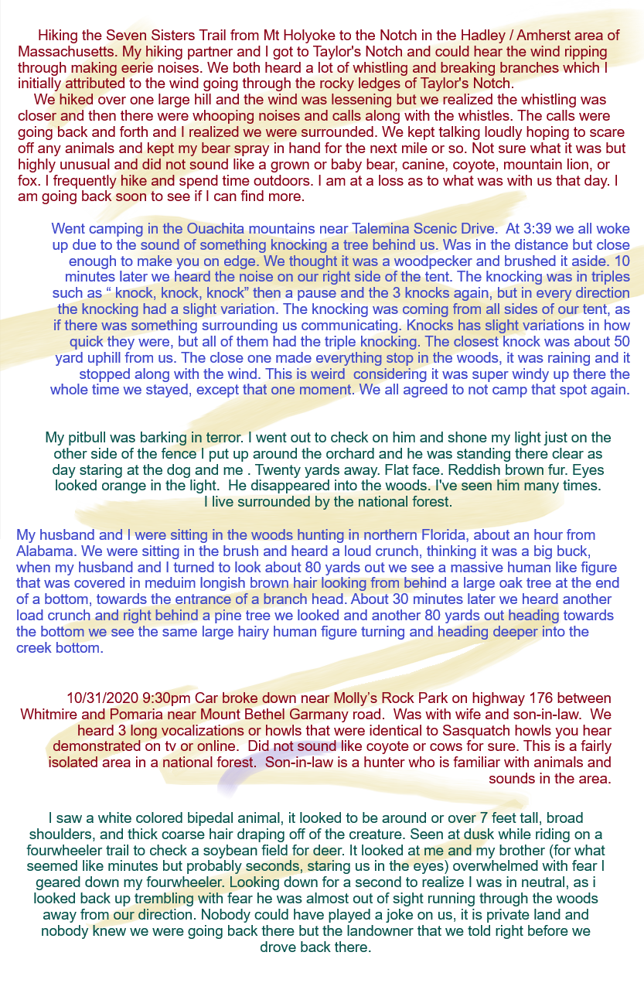
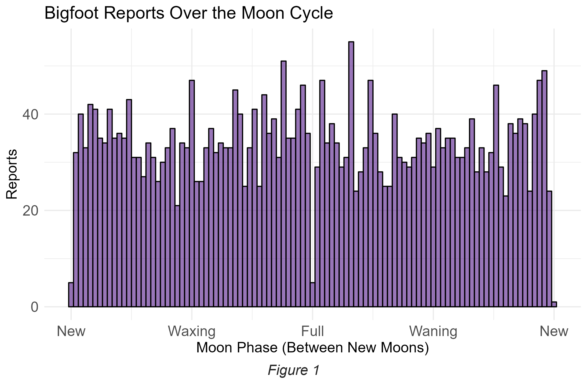
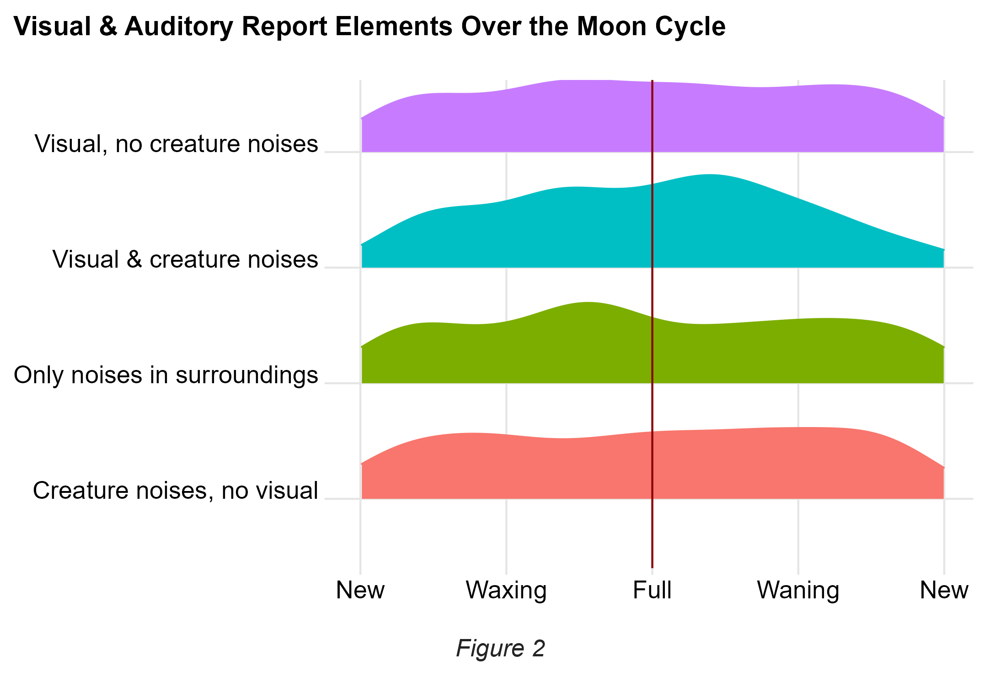
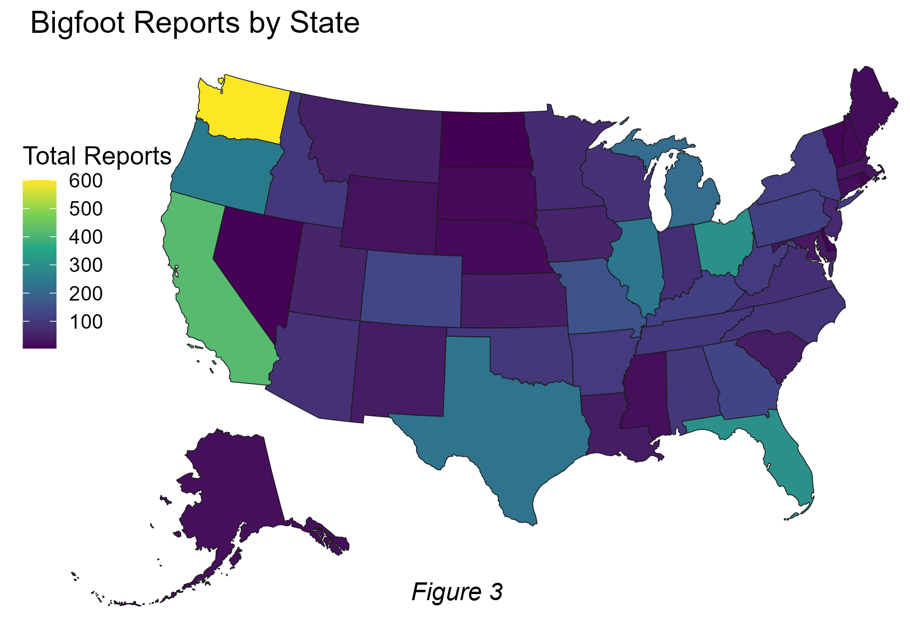
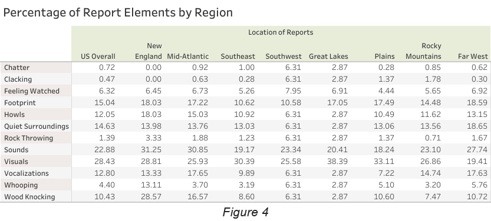

```{=html}
<style>
.navbar {
  background-color:slateblue;
  border-color:darkgreen;
}
</style>
```
```{r setup, include=FALSE}
library(flexdashboard)
```

# Introduction

## Sidebar {.sidebar data-width="600"}

This is the dashboard version of my final project for the capstone course of my DACSS degree program at UMass Amherst. The final project itself consists of a [PDF](Reporting%20Bigfoot%20-%20Odd%20Sightings%20and%20Encounters.pdf) and a [presentation](https://youtu.be/wjIcmvCrQ-g).

#### **The Data Set**

-   Over 5,000 reports of Bigfoot encounters within the continental United States spanning from November 1869 to November 2021
-   Report details from Bigfoot Field Researchers Organization ([BFRO](https://bfro.net/))
-   Supplemental weather data (e.g., temperature, UV index, humidity, moon phase) from now-defunct Dark Sky API added by [Tim Renner](https://data.world/timothyrenner)
-   A **limitation** of the data set: Report accuracy relies on human recall abilities. Reports written by people recalling sightings from years or even decades earlier may have less reliable data due to the fallibility of human recollection.
-   A major **boon** of the data set: Contributors are able to describe their encounters at length, including specific details that offer a fuller context of their experience.

#### **Research Questions**

-   Which geographical areas in the U.S. have the most reported encounters?
    -   Which areas have notably high rates of report elements such as hearing creature noises?
-   Do any atmospheric conditions correspond strongly to the frequency of reported encounters or to certain report elements?

#### **Methods**

-   The titles and descriptive text of encounters were used to identify key ***report elements***, such as visual sightings of a creature, hearing vocalizations made by a creature (e.g., howling, whooping), hearing certain sounds in the environment such as wood knocking or rock clacking, or finding a footprint.

-   Reports were sorted into one of 8 geographic regions based on which state the encounter occurred in - New England, the Mid-Atlantic, the Southeast, the Southwest, the Great Lakes, the Plains, the Rocky Mountains, and the Far West - to look for notably high regional rates of certain report elements.

-   The amount of reports was measured over the course of the moon cycle, which is measured from one new moon to the next, with the full moon at the halfway point (0.5).

    The moon phase was chosen over other atmospheric condition variables like temperature or precipitation because of the powerful influence that extreme or inclement weather conditions can exert over human decision-making (such as not driving unnecessarily when visibility is low, or opting out of a planned hike because of surprise heavy rain). The moon phase was chosen over the other options because humans don't typically use the phase of the moon as a deciding factor whether or not to go outside into an environment where they might see an unusual animal.

## Column {data-width="500"}

```{r picturereport, echo=F, out.width='100%', fig.align='center'}

```

# Moon Cycle Findings

## Sidebar {.sidebar data-width="500"}

#### **Bigfoot Reports Over the Moon Cycle**

-   There are roughly 25 to 40 reported encounters for most days of the moon cycle, and there is not a strong pattern overall.

-   BUT the number of encounters drops dramatically right as the moon is at its fullest point and then again when the moon is at its darkest at the very beginning and very end of the cycle. There are only 5 reported encounters from days when the full moon was exact.

-   Unclear whether this is due to less Bigfoot activity or less human activity or just a wild coincidence.

------------------------------------------------------------------------

#### **Report Elements Over the Moon Cycle**

-   Reports where a creature was either seen but not heard (top blob of Figure 2) or heard but not seen (bottom blob of Figure 2) are fairly uniform throughout the moon cycle.

-   Reports of *environmental/surrounding noises* (e.g., wood knocking, rock clacking) peak around the waxing gibbous phase, just a few days before the moon is full.

-   Reports where a creature is ***both seen and heard*** seem to grow with the moon and peak just after the full moon during the waning gibbous phase, then decline for the rest of the waning period heading into the next new moon.

-   All report types dip in frequency around the new moon, which makes sense because that's one of the points when the fewest encounters are reported overall.

## Column {data-width="500"}

```{r picture1, echo=F, out.width='80%', fig.align='center'}

```

------------------------------------------------------------------------

```{r picture2, echo=F, out.width='80%', fig.align='center'}

```

# Where is Bigfoot?

## Sidebar {.sidebar data-width="500"}

#### **Where is Bigfoot?**

-   There are **601** reports from the state of Washington - roughly **12%** of all the reports in the BFRO collection

-   High numbers in Oregon and California give the West Coast **over 25%** of all reports

The high number of reports in Washington state is unsurprising, as Bigfoot - Sasquatch - has a strong association with the Pacific Northwest. The wide expanse of National Park land and old-growth forests in Washington within short travel distance from major population centers like Seattle/Tacoma create the opportunity for more humans to be wandering around in areas where a creature like Bigfoot could be living (and hiding).

However, the fact that Bigfoot is already so culturally tied to the Pacific Northwest may also create a feedback loop effect wherein

1.  people who are curious or hoping to see a Bigfoot creature proactively go to parts of Washington where there have already been sightings and have their own encounter, and these people may be more likely to report their encounter due to a pre-existing interest in the subject, or

2.  people in the area are already primed with the idea that Bigfoot creatures have been sighted and may more readily interpret strange sights or sounds to be Bigfoot-related than they would in other parts of the country.

## Column {data-width="500"}

```{r picture3, echo=F, out.width='100%', fig.align='center'}


```

# Notable Regional Activity

## Sidebar {.sidebar data-width="500"}

#### **Spikes in Report Elements by Region**

-   Two findings of notable regional activity (compared to overall/nationwide data)

-   *23%* of all reports include creature sounds (vocalizations, whooping, howling), but

    -   In the Mid-Atlantic states (New York, Pennsylvania, New Jersey, Delaware, Maryland), creature sounds appear in **31%** of reports in the region.

-   Visual sightings of creatures account for *28%* of all reports nationwide, but

    -   Creatures are seen in **38%** of reports coming from the Great Lakes region (Wisconsin, Michigan, Indiana, Illinois, and Ohio).

Curious squatchers looking to record vocalizations may want to focus in on the Great Lakes region first, while those interested in trying to lure Bigfoot into a photoshoot or catch a glimpse as a surprise cameo on a trail cam may instead opt to trawl the backwoods of New York and Pennsylvania.

## Column {data-width="500"}

```{r picture4, echo=F, out.width='100%', fig.align='center'}

```
