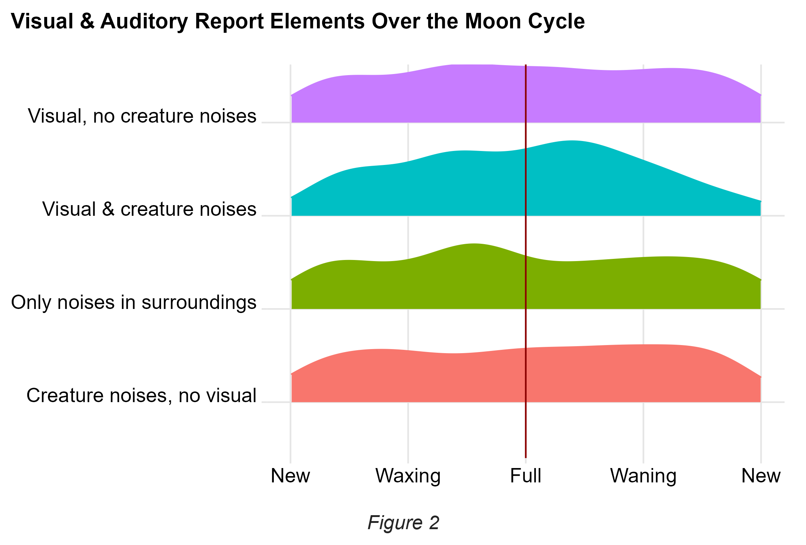
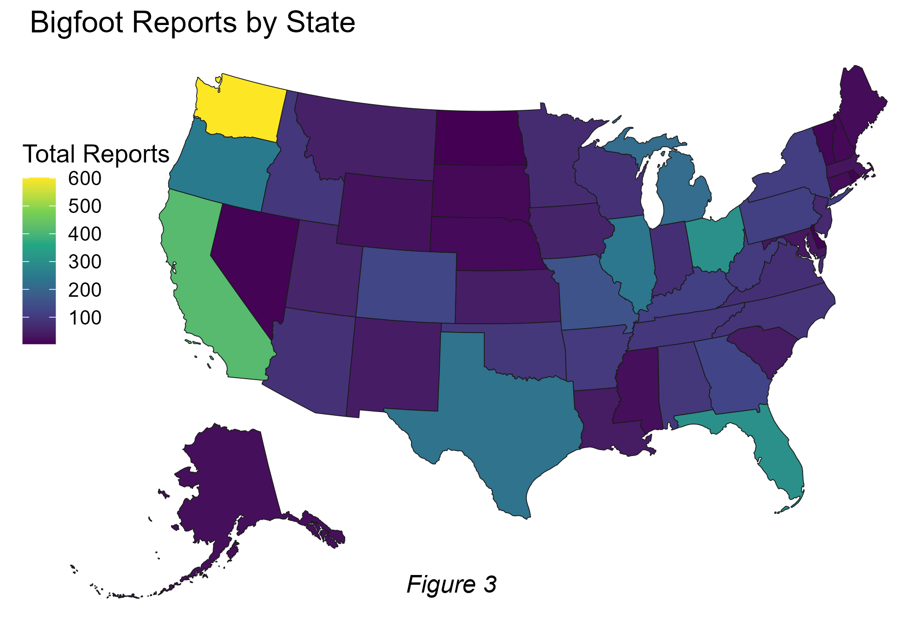
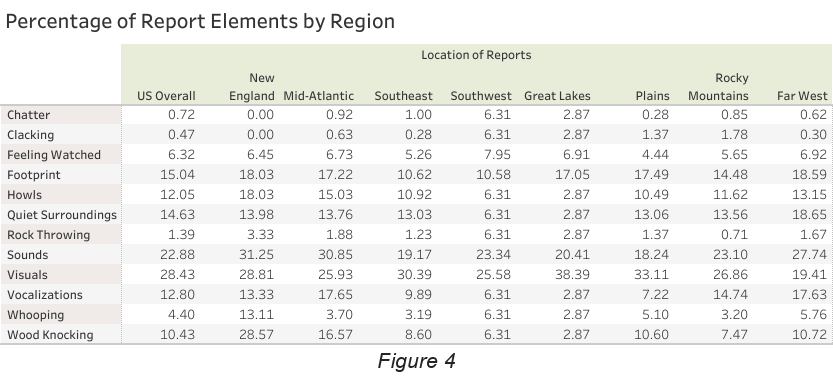

```{r setup, include=FALSE}
knitr::opts_chunk$set(echo = TRUE)
```

## Meeting Bigfoot

Sasquatch. Momo the Missouri Monster. Skunk Ape. Bigfoot. This legendary species of giant, hairy, human-like wood ape - existence unconfirmed - has allegedly been spotted all over North America and has been given many regional nicknames.

Although North American settlers began reporting sightings of such creatures in the 1800s, stories and art of the mysterious wildmen of the woods predate these sightings. Pictographs of a Bigfoot family estimated to be from 500 AD appear at Painted Rock on the Tule River Reservation in California, and Bigfoot-like beings feature in numerous tales from indigenous populations.

Attempts to record visual evidence of the wood ape have proven famously blurry and indistinct. The 1967 Patterson-Gimlin footage, which purportedly depicts a female Bigfoot walking near Bluff Creek in northern California and momentarily turning to look toward Roger Patterson who manned the camera, suffers less from pure blurriness and more from the distance between camera and subject.

Another duo, Ron Morehead and Al Berry, also created influential recordings of Bigfoot soon afterwards. Recorded in the Sierra Nevada mountains in the 1970s, the Sierra Sounds captures audio of a group of creatures chattering back and forth to each other and also presumably in response to amplified calls from Berry and Morehead. The creature chatter mimics the cadence of human speech, but the vocalizations included frequencies that humans cannot produce. These noises and other vocalizations like howling or whooping are some of the recurring elements noted in Bigfoot encounters. Other common recurring elements include wildlife falling silent, feelings of being watched, rock throwing, the sounds of rocks clacking or wood/tree knocking, and of course the classic footprint.

While stumbling upon a Squatch in the wild seems to be a matter of luck (whether that luck is good or bad is up for debate), there is data available to look for patterns for curious Bigfoot believers, or squatchers. Which geographical areas in the United States have the most reported encounters? Which areas have notably high rates of certain elements, such as hearing creature noises? Do any atmospheric conditions correspond strongly to the frequency of reported encounters or to certain report elements?

## The BFRO Report Collection

The Bigfoot Field Researchers Organization (BFRO) website features a comprehensive database of Bigfoot sightings and other possible encounters with such creatures. Data scientist Tim Renner pulled report data from the BFRO site and used the now defunct Dark Sky API to add supplemental weather data such as the temperature, humidity, visibility, wind speed, and phase of the moon for the date and location of the reports. This collection includes over 5,000 reports of Bigfoot encounters within the continental United States (every state except for Squatch-less Hawaii) spanning from November 1869 to November 2021.

One notable limitation of the reports is that they are dependent on human recall abilities to give accurate information on the date, location, and details of the encounter. Reports written by people who are recalling a sighting from years or even decades earlier may have less reliable data due to the fallibility of human recollection.

Most of the reports are firsthand accounts, and the major boon of this collection of reports is that the contributors were able to describe their encounters at length, including specific details and offering a fuller context of what they experienced. These long-form descriptions of each encounter were used to identify certain key elements within the reports, such as visual sightings of a creature, noises biologically created by a creature such as whooping or chatter, or sounds in the environment presumably caused by the creature using tools, such as wood knocking or rock clacking. For example, this report from 2009 describes an encounter with both creature noises (howling) and visual elements:

> “In early June of this year I was riding my four wheeler above Jasper, Colorado, at about 7:00 in the morning. I had stopped to rest at the logging block, when I heard a loud howling noise. There was no wind that day, and I could not focus in on the source. I had seen a lot of sheep on Cornwall mountain on the way up so I figured it was a dog or the sheep herder. When I had finished my water I was loading everything back on the bike,when I heard the same sound again, only this time it was much louder. I zeroed in on it and my heart stopped. Slightly below my logging road and to my right I observed a very large dirty black man-like creature with his hands around an aspen tree. It was leaning a little to the right and staring at me. I stood very still and never took my eyes off of it. After about seven or eight minutes it turned and simply walked off down the hill. I will add that I am a 30 year archery hunter, and have successfully tagged bears in this same unit. This was no bear. It was large and shaggy looking.”

The supplemental weather data from Dark Sky API indicates that this incident occurred just a few days after a full moon, on a day with a high temperature of about 42 degrees Fahrenheit, and that at some point it rained. Can any of these atmospheric conditions of the day provide insight? They might, but there’s a catch. A necessary ingredient in the creation of any Bigfoot report is the presence of a human witness, and human decision making can easily be influenced by the weather. For instance, somebody who was planning to go hiking on Saturday might opt out if it ends up raining that Saturday, or a person may avoid unnecessary driving if there’s more fog than usual for the area. Because extreme temperatures or other inclement weather can deter people from placing themselves in locations where they are more likely to encounter an unusual creature, measuring these atmospheric conditions largely ends up measuring when humans are more likely to be out and about in natural settings. 

The phase of the moon, however, does not typically wield such a powerful, direct influence on such decisions. The moon will be full or new or a waning gibbous regardless of if the weather in Jasper, Colorado on June 10th is sunny or cloudy, rainy or dry. As the lunar cycle has been shown to influence the behavior of some animals, measuring the moon phase may offer insight into patterns of Bigfoot behavior rather than solely that of their human witnesses. Report frequency and different report elements can be measured against the moon cycle to discover patterns or lack thereof.

## Bigfoot Reports Over the Course of the Moon Cycle


Reports were sorted by their associated moon phase and counted to see how many potential Bigfoot encounters occurred during different moments of the lunar cycle, measuring from new moon to new moon so that the full moon falls at the halfway point. Figure 1 shows that there are about 25 to 40 reported encounters for most moments of the moon cycle, and there is not a strong pattern overall. Most of the encounters during the waxing period of the moon fall within these values, as do those which occurred during the waning period. 

However, the number of encounters drops dramatically right as the full moon becomes exact and again when the moon is dark (new) at the very beginning and end of the lunar cycle. There are only five reported encounters from days when the moon is fullest. Whether this is due to less Bigfoot activity or less human activity during these moments of peak lunar light and peak darkness is unclear.

## Moon Phases & Report Elements



Using the text of the long-form encounter descriptions and the shorter report titles, Bigfoot reports were identified as including or not including elements such as visual sightings, vocalizations or other creature noises, and sounds heard in the surroundings such as wood knocking or rock clacking. Then the reports were sorted into four categories: reports in which a creature was seen but not heard, reports in which a creature was heard but not seen, reports in which a creature was both seen and heard, and reports in which the witness solely heard sounds in their surroundings. 

Figure 2 demonstrates that most of the report categories don’t show a strong preference for any particular segment of the lunar cycle. Encounters wherein a creature is seen but not heard or heard but not seen remain fairly uniform throughout the cycle, with slight dips during the new moon. Reports of hearing only noises in the surrounding environment such as rock clacking slightly peak around the waxing gibbous just before the moon is full, but remain fairly stable until reports dip at the new moon. 

However, the amount of reports where a creature is both seen & heard appears to grow with the moon and peak just after the moon is full. After its height at the waning gibbous phase, this type of encounter then begins a steady but staunch decline until the moon is dark again. The phase when these highly eventful encounters occur is also when the number of reports overall spike to their maximum value of 55, as seen in Figure 1. While this type of encounter accounts for only a small percentage (1.5%) of the total reports and probably does not account for the spike in overall reports around this point in the lunar cycle, this alignment suggests that Bigfoot activity during the waning gibbous phase may become more intense or more noticeable to humans, who then may feel more strongly inclined to share their experiences. 

## Where Do People Find Bigfoot?



Reports were sorted by US state to produce a total-count-per-state of the encounters described in the data set. Perhaps unsurprisingly, the state of Washington boasts the highest number of Bigfoot encounters, with roughly 12% of all reports. California and Oregon also rank highly in this measure, and together these three West Coast states account for over 25% of all Bigfoot reports in the BFRO collection. 

Washington state is well-positioned for its stronghold on Sasquatch stories. The state’s massive expanse of national park land and old-growth forests within quick travel distance of major population centers like Seattle and Tacoma creates great opportunity for the ingredients of a Bigfoot report to combine: there’s plenty of areas where Bigfoot creatures would be able to live (and hide), and there are lots of people who might go wandering in those areas. However, the strong pre-existing association between the Pacific Northwest and Sasquatch sightings may also create a feedback loop where squatchers visit and pay more attention to Washington state due to its reputation for increased Bigfootery.

## Heightened Regional Activity

Reports were separated into 8 geographic regions based on state location. The states were grouped into regions in the following manner: 

-   **New England**: the states of Maine, New Hampshire, Vermont, Massachusetts, Rhode Island, and Connecticut.

-   **Mid-Atlantic**: the states of New York, New Jersey, Pennsylvania, Delaware, and Maryland.

-   **Southeast**: the states of Virginia, West Virginia, Kentucky, Tennessee, North Carolina, South Carolina, Georgia, Florida, Mississippi, Louisiana, Alabama, and Arkansas.

-   **Great Lakes**: the states of Ohio, Indiana, Illinois, Michigan, and Wisconsin.

-   **Plains**: the states of Missouri, Kansas, Iowa, Minnesota, North Dakota, South Dakota, and Nebraska.

-   **Rocky Mountains**: the states of Montana, Idaho, Wyoming, Utah, and Colorado.

-   **Southwest**: the states of Texas, Oklahoma, New Mexico, and Arizona.

-   **Far West**: the states of Nevada, California, Oregon, Washington, and Alaska.

	Frequencies for 12 different report elements (listed vertically in Figure 4 from chatter to wood knocking) were run, first for the entire set of reports and then for each individual region, to calculate what percentage of encounters included each element. Comparing regional rates to overall rates revealed two report elements that are notably more prominent in certain regions than they are for the US overall. 



While nearly 23% of all reports nationwide include the element of creature sounds (this includes any instance or combination of whooping, howling, chatter, or other vocalizations), the Mid-Atlantic region is particularly loud with 35% of its reports featuring vocal creatures. 

The Great Lakes region shows up ready to impress as well, as 38% of encounters in the Great Lake states feature visual sightings of a creature. The percentage of visual reports nationwide is only 28. 

The comparatively high percentages of visual and auditory elements within the Mid-Atlantic and Great Lakes regions suggest that these areas may be fruitful for people hoping to create new recordings of Bigfoot. The Great Lake states may be a strong starting point for squatchers looking to capture photographs or video footage like Patterson and Gimlin, while others might opt to camp out in the Mid-Atlantic region to create an East Coast series of Sierra Sounds. 

High standout percentages from New England were dismissed due to the relatively low amount of reports associated with the region; reports from New England account for less than 2% of all reports in the BFRO collection. 

## Conclusions and Further Research

This exploration of BFRO’s reports indicates that while Washington is the major hotspot for Sasquatch encounters, your best geographical bet for seeing a Squatch with your own two eyes may be the Great Lakes region instead. Similarly, if you want to hear the dulcet tones of a Bigfoot voice, you might want to trawl the woods of New York and Pennsylvania. 

Measuring report activity alongside the lunar cycle shows that the moon does not seem to correspond strongly with Bigfoot encounters most of the time, but it is rare to have (and then report) an encounter when the moon is at its fullest or its darkest. Bigfoot activity may be somewhat more noticeable during the waning gibbous phase of the moon than at other periods. 

Further research could make use of updates to Renner’s data set, which would include more recent reports and weather data from Visual Crossing Weather instead of the defunct Dark Sky API. More exploration of regional patterns could be enlightening, particularly considering human witnesses’ subjective emotional experiences and perceptions of creature hostility during encounters. For example, are the Sasquatches of the Pacific Northwest perceived with more awe and wonder than the Florida Skunk Ape? Are human witnesses more fearful of a creature encountered in Texas than in Illinois? 

Searching for weather patterns in regards to footprint reports would be another option for further investigation, as footprints - particularly castable footprints - likely need particular conditions in order to maintain their form. Finding such patterns could enable curious new squatchers to select the most weather-appropriate days to search for fresh tracks. 

Deeper examinations of the drop in reported Bigfoot encounters during the full and new moon could also be illuminating. Future projects could compare encounter dates against eclipse dates to see if there is an uptick in reports within a few days of lunar or solar eclipses, especially in geographic areas within paths of totality or partiality for solar eclipses. The rare new and full moons when reported Bigfoot encounters occur may share this additional layer of astronomical distinction. 
